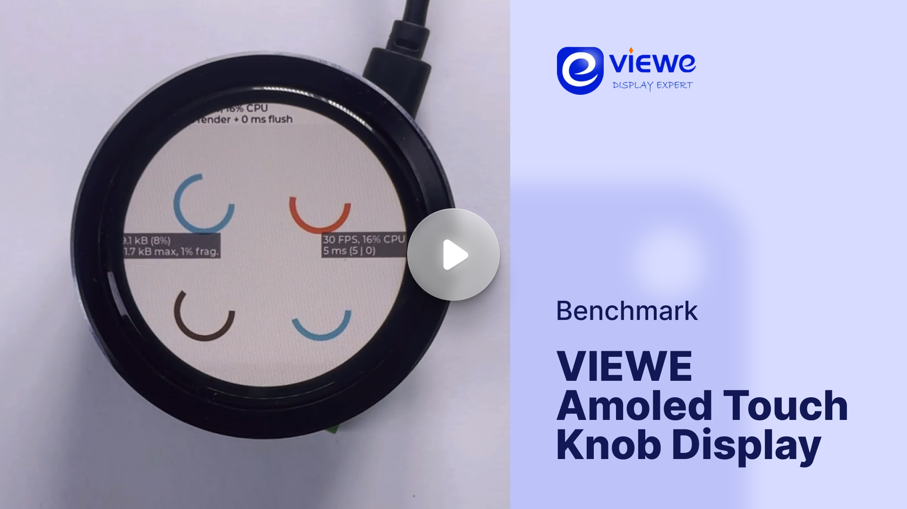

# LVGL ported to VIEWE 1.5" Touch Knob

## Overview

The Viewe Touch Knob Display, designed and developed by Viewe Display, features a high-resolution 466x466 AMOLED panel with 1000 cd/m² brightness, a rotary knob with an integrated push button, and capacitive touch input. Powered by an ESP32-S3 (240 MHz) with 8 MB RAM and 16 MB Flash, it supports Wi-Fi, BLE 5, and BLE Mesh. Compatible with Arduino, ESP-IDF, and LVGL, it offers UART and USB interfaces. Ideal for IoT and AIoT projects, the touch-enabled knob display is perfect for creating intuitive control panels, smart home hubs, industrial interfaces, and embedded dashboards.

## Buy

You can purchase Viewe Touch Knob Display from https://viewedisplay.com/product/esp32-1-5-inch-466x466-round-amoled-knob-display-touch-screen-arduino-lvgl/

## Benchmark

The display is driven using QSPI interface. Two display LVGL draw buffers are used (472x40x2) with `LV_DISPLAY_RENDER_MODE_PARTIAL` mode.

Check out Viewe Touch Knob Display in action, running LVGL's benchmark demo:

### Benchmark Summary (9.3.0 )

| Name                      | Avg. CPU  | Avg. FPS  | Avg. time | render time   | flush time    |
| ------------------------- | --------- | --------- | --------- | ------------- | ------------- |
| Empty screen              | 94%       | 23        | 39        | 21            | 18            |
| Moving wallpaper          | 98%       | 19        | 48        | 39            | 9             |
| Single rectangle          | 21%       | 28        | 2         | 1             | 1             |
| Multiple rectangles       | 57%       | 28        | 19        | 15            | 4             |
| Multiple RGB images       | 50%       | 28        | 15        | 14            | 1             |
| Multiple ARGB images      | 70%       | 28        | 24        | 23            | 1             |
| Rotated ARGB images       | 63%       | 28        | 21        | 20            | 1             |
| Multiple labels           | 95%       | 22        | 40        | 37            | 3             |
| Screen sized text         | 99%       | 7         | 126       | 118           | 8             |
| Multiple arcs             | 42%       | 28        | 10        | 9             | 1             |
| Containers                | 53%       | 28        | 23        | 22            | 1             |
| Containers with overlay   | 86%       | 17        | 55        | 49            | 6             |
| Containers with opa       | 59%       | 27        | 25        | 24            | 1             |
| Containers with opa_layer | 78%       | 23        | 39        | 38            | 1             |
| Containers with scrolling | 97%       | 10        | 91        | 82            | 9             |
| Widgets demo              | 99%       | 5         | 143       | 136           | 7             |
| All scenes avg.           | 72%       | 21        | 44        | 40            | 4             |

## Specification

### CPU and Memory
- **MCU:** ESP32-S3 240Mhz
- **RAM:** 512 KB internal, 8MB external PSRAM
- **Flash:** 16MB External Flash
- **GPU:** None

### Display and Touch
- **Resolution:** 466x466
- **Display Size:** 1.5"
- **Interface:** QSPI (CO5300AF-42)
- **Color Depth:** 16-bit
- **Technology:** AMOLED
- **DPI:** 439px/inch
- **Touch Pad:** Capacitive (CST816S)

### Connectivity
- Integrated Rotary Knob
- Integrated Push Button

## Getting started

### Hardware setup
- First connect the FPC from the display to the extension board then connect a Micro USB cable to the extension board.

### Software setup
- Install CH340G drivers for UART chip
- Install the VS Code IDE & PlatformIO extension

### Run the project
- Clone this repository: 
- Open the code folder using VS Code. PlatformIO needs to be installed. ESP-IDF will automatically be installed if not present
- Configure the project. Click on the gear icon (SDK Configuration editor)
- Build the project. Click on the wrench icon (Build Project)
- Run or Debug. Alternatively click on the fire icon (ESP-IDF: Build, Flash & Monitor) to run flash and debug the code

### Debugging
- Debug using ESP Logging Library `ESP_LOGE, ESP_LOGI ...`
- After flashing (ESP-IDF: Build, Flash & Monitor), a terminal will appear showing the logs

## Contribution and Support

If you find any issues with the development board feel free to open an Issue in this repository. For LVGL related issues (features, bugs, etc) please use the main [lvgl repository](https://github.com/lvgl/lvgl).

If you found a bug and found a solution too please send a Pull request. If you are new to Pull requests refer to [Our Guide](https://docs.lvgl.io/master/CONTRIBUTING.html#pull-request) to learn the basics.